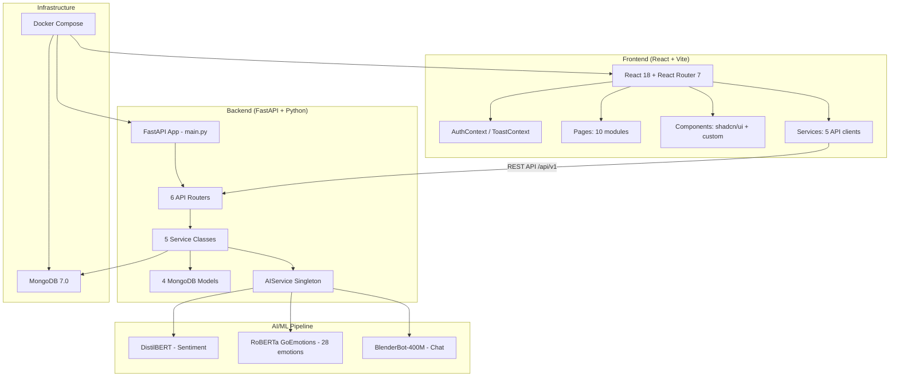

# TheraAI-FYP-I — Project Reference

> **AI-powered therapy assistance platform** · Full-stack web app with local ML inference
> **Repo**: `c:\Users\dawoo\Projects\GitHub\TheraAI-FYP-I`

---

## Architecture Overview



---

## Tech Stack

| Layer | Technology | Details |
|-------|-----------|---------|
| **Frontend** | React 18, Vite 7.1.7, TailwindCSS 3.4.17 | Radix UI primitives, Recharts, Lucide icons |
| **Backend** | FastAPI, Python, Pydantic v2 | Async, Motor (async MongoDB driver), uvicorn |
| **Database** | MongoDB 7.0 | Collections: `users`, `journals`, `moods`, `conversations`, `messages`, `chat_history` |
| **AI/ML** | PyTorch, HuggingFace Transformers | GPU-accelerated (CUDA), CPU fallback |
| **Auth** | JWT (HS256), bcrypt | Access token (30 min) + refresh token (7 days) |
| **DevOps** | Docker Compose | 3 services: mongodb, backend, frontend |

---

## Backend Deep Dive

### API Routes (`/api/v1`)

| Router | Prefix | Endpoints | Key Features |
|--------|--------|-----------|-------------|
| `auth` | `/auth` | signup, login, me, change-password, refresh, logout, health | JWT auth, role-based access |
| `journal` | `/journals` | CRUD + `/stats` | Auto AI analysis on create/update |
| `chat` | `/chat` | `/message`, `/history`, `DELETE /history` | BlenderBot + conversation context |
| `moods` | `/moods` | CRUD | Standalone mood logging |
| `stats` | `/users` | `/me/stats`, `/me/achievements`, `/me/activity` | Streaks, XP, levels, 12 achievements |
| `conversations` | `/conversations` | CRUD for chat conversations | Multi-conversation support |

### Data Models

**User** (`models/user.py`) — 3 roles: `patient` / `psychiatrist` / `admin`
- Fields: email (unique), full_name, role, hashed_password, login_attempts, locked_until
- Schemas: `UserIn`, `UserLogin`, `UserOut`, `UserInDB`, `UserUpdate`, `Token`, `TokenData`, `PasswordChange`

**Journal** (`models/journal.py`) — Mood tracking + dual AI analysis
- Mood types: happy, sad, anxious, angry, calm, excited, stressed, neutral
- AI fields: `sentiment_label`, `sentiment_score`, `empathy_response`, `emotion_themes`, `top_emotions`
- Computed `ai_analysis` property maps backend fields → frontend structure
- Schemas: `JournalCreate`, `JournalOut`, `JournalInDB`, `JournalUpdate`, `MoodStatistics`

**Mood** (`models/mood.py`) — Simple mood + notes + timestamp

**Conversation** (`models/conversation.py`) — Chat sessions with `MessageModel`

### AI Service (`services/ai_service.py`) — 742 lines, Singleton

Three ML models loaded at startup:

| Model | Purpose | Size | Details |
|-------|---------|------|---------|
| `distilbert-base-uncased-finetuned-sst-2-english` | Sentiment analysis | ~268MB | Binary: POSITIVE/NEGATIVE |
| `SamLowe/roberta-base-go_emotions` | Emotion detection | ~499MB | 28 emotion categories, returns top 5 |
| `facebook/blenderbot-400M-distill` | Conversational chat | ~1.6GB | Context-aware responses |

Key methods:
- `analyze_text(text)` → `AIAnalysisResult` (sentiment + emotions + empathy response)
- `generate_response_llm(message, history)` → chat response (with personal-claim filtering)
- `analyze_sentiment(text)` / `analyze_emotions(text)` / `generate_empathy_response(...)`
- GPU auto-detection: RTX 3070 (FP16), other NVIDIA (FP32), CPU fallback

### Services Layer

| Service | File | Key Methods |
|---------|------|-------------|
| `UserService` | `user_service.py` | create_user, authenticate_user, get_user_by_id, update_user |
| `JournalService` | `journal_service.py` | create_entry (with AI), get_user_entries, update_entry (re-runs AI), delete_entry, get_mood_statistics |
| `MoodService` | `mood_service.py` | CRUD for standalone mood entries |
| `ConversationService` | `conversation_service.py` | CRUD for chat conversations |
| `AIService` | `ai_service.py` | Sentiment, emotion, chat (see above) |

### Database Indexes

- **users**: email (unique), role, is_active, created_at, compound(email+role)
- **journals**: compound(user_id+created_at desc), user_id, mood, sentiment_label, created_at

---

## Frontend Deep Dive

### Routing (`App.jsx`)

| Route | Page | Access |
|-------|------|--------|
| `/` | LandingPage | Public |
| `/login`, `/signup` | Login, Signup | Public only (redirect if auth'd) |
| `/dashboard` | Dashboard | Protected (all roles) |
| `/journal` | Journal | Protected |
| `/journal/:id` | JournalDetail | Protected |
| `/mood` | MoodTracker | Protected |
| `/chat` | Chat | Protected |
| `/profile` | Profile | Protected |
| `/settings` | Settings | Protected |
| `/assessments` | Assessments | Protected |
| `/appointments` | Appointments | Protected |
| `/patients` | Placeholder | Psychiatrist + Admin only |
| `/users` | Placeholder | Admin only |
| `/sessions`, `/community`, `/progress`, `/resources` | Placeholders | Role-restricted |

### Frontend Services

| Service | File | Methods |
|---------|------|---------|
| `authService` | `authService.js` | login, signup, getProfile, refreshToken, changePassword |
| `journalService` | `journalService.js` | createEntry, getEntries, getEntryById, updateEntry, deleteEntry, getStats |
| `chatService` | `chatService.js` | sendMessage, getHistory, clearHistory |
| `moodService` | `moodService.js` | CRUD for mood records |
| `statsService` | `statsService.js` | getUserStats, getAchievements, getActivityFeed |

### Component Library (12 shadcn/ui components)

Button, Input, Card, Loading, Alert, Avatar, Badge, Progress, Skeleton, Separator, Tooltip, Modal

### Contexts

- **AuthContext**: JWT token management, user state, login/logout/signup actions
- **ToastContext**: Global notification system (bottom-right, non-blocking)

---

## Module Completion Status

| Module | Backend | Frontend | Notes |
|--------|---------|----------|-------|
| **Authentication** | ✅ 100% | ✅ 100% | JWT + role-based, working E2E |
| **UI Foundation** | — | ✅ 100% | shadcn/ui, design system, 12 components |
| **Dashboard** | ✅ 100% | ✅ 100% | Stats, achievements, activity feed (with mock data) |
| **Journal + Mood Tracking** | ✅ 100% | ✅ 100% | AI sentiment + emotion analysis, CRUD |
| **AI Chat** | ✅ 100% | ✅ 100% | BlenderBot + history + fallback |
| **Standalone Mood API** | ✅ 100% | ✅ 100% | Quick mood log separate from journal |
| **Profile** | Partial | ✅ Page exists | Change-password `TODO` in backend |
| **Settings** | — | ✅ Page exists | Frontend-only currently |
| **Assessments** | — | ✅ Page exists | No backend yet |
| **Appointments** | — | ✅ Page exists | No backend yet |
| **Psychiatrist Dashboard** | ❌ | ❌ | Not started |
| **Admin Dashboard** | ❌ | ❌ | Not started |
| **Video Calls** | ❌ | ❌ | Not started |
| **Real-time Messaging** | ❌ | ❌ | Not started |

---

## Known Issues & TODOs

> [!WARNING]
> **Change-password endpoint** (`POST /auth/change-password`) is a stub — returns success without actually verifying or changing the password.

> [!NOTE]
> - Several routes in `App.jsx` use placeholder `<div>` instead of real pages (`/patients`, `/sessions`, `/community`, `/progress`, `/resources`, `/users`)
> - `CURRENT_STATUS.md` in docs is outdated (Dec 2025) — frontend was completed since then
> - Some `datetime.utcnow()` usage (deprecated in Python 3.12+) should migrate to `datetime.now(timezone.utc)`
> - Achievement system `early_bird` and `night_owl` are hardcoded `unlocked: false`
> - Chat response filtering is keyword-based; could benefit from more sophisticated NLP

---

## File Structure (Key Files)

```
TheraAI-FYP-I/
├── docker-compose.yml           # 3-service orchestration
├── .env.docker                  # Production env config
├── backend/
│   ├── app/
│   │   ├── main.py              # FastAPI app, lifespan, routers
│   │   ├── config.py            # Pydantic Settings (env vars)
│   │   ├── database.py          # Motor async MongoDB manager
│   │   ├── api/
│   │   │   ├── auth.py          # Auth endpoints (288 lines)
│   │   │   ├── journal.py       # Journal CRUD (258 lines)
│   │   │   ├── chat.py          # AI chat endpoints (246 lines)
│   │   │   ├── moods.py         # Mood CRUD
│   │   │   ├── stats.py         # User stats/achievements (380 lines)
│   │   │   └── conversations.py # Chat conversation management
│   │   ├── models/
│   │   │   ├── user.py          # User + Token schemas (189 lines)
│   │   │   ├── journal.py       # Journal + AI analysis (382 lines)
│   │   │   ├── mood.py          # Mood schemas
│   │   │   └── conversation.py  # Conversation + Message schemas
│   │   ├── services/
│   │   │   ├── ai_service.py    # 3 ML models, singleton (742 lines)
│   │   │   ├── journal_service.py
│   │   │   ├── user_service.py
│   │   │   ├── mood_service.py
│   │   │   └── conversation_service.py
│   │   ├── utils/auth.py        # JWT helpers, password hashing
│   │   └── dependencies/auth.py # get_current_user dependency
│   ├── requirements.txt
│   └── Dockerfile
├── web/
│   ├── src/
│   │   ├── App.jsx              # Router with 14+ routes
│   │   ├── pages/               # 10 page modules (V0 versions)
│   │   ├── components/          # 7 component groups + shadcn/ui
│   │   ├── services/            # 5 API service clients
│   │   ├── contexts/            # AuthContext, ToastContext
│   │   └── lib/                 # Utility functions
│   ├── package.json
│   ├── tailwind.config.js
│   └── vite.config.js
├── thera-ai-landing-page-design/ # Separate Next.js landing page project
├── docs/                         # Project documentation (8 files)
└── work_logs/                    # Development work logs
```

---

## How to Run

```bash
# Backend (local dev)
cd backend
pip install -r requirements.txt
uvicorn app.main:app --reload     # http://localhost:8000/docs

# Frontend (local dev)
cd web
npm install
npm run dev                        # http://localhost:5173

# Docker (all services)
docker-compose up --build          # backend:8000, frontend:3000, mongo:27017
```
